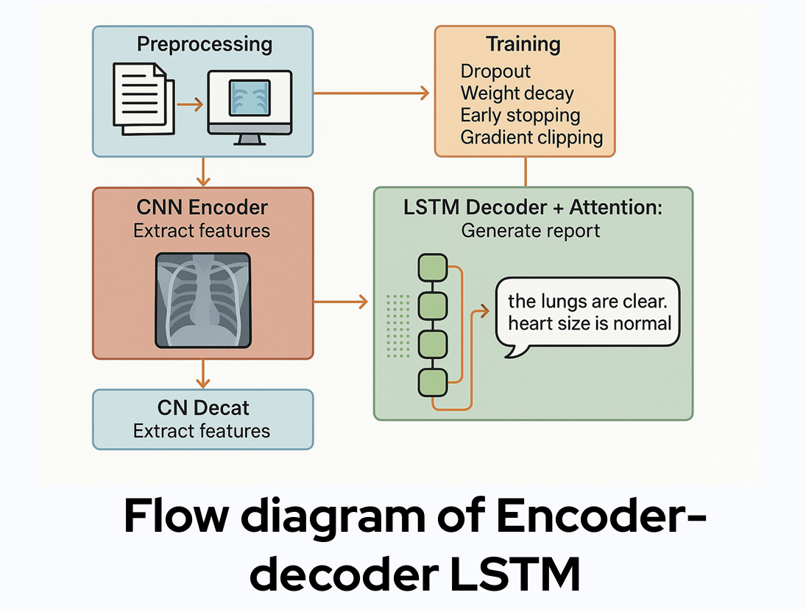
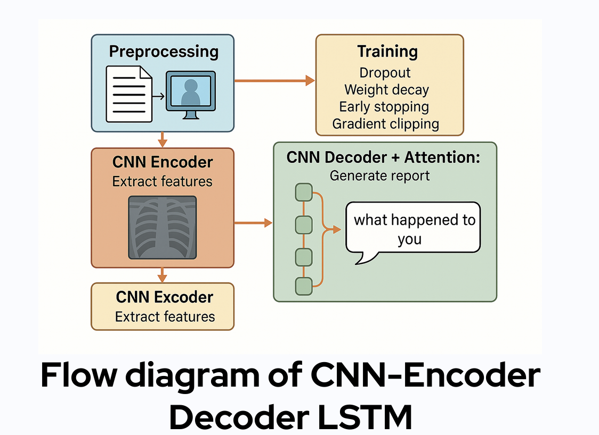
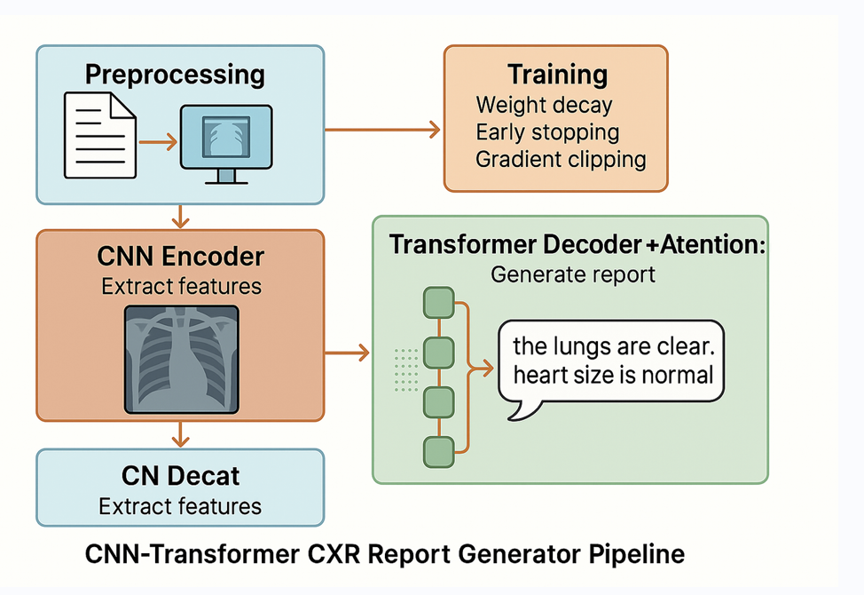
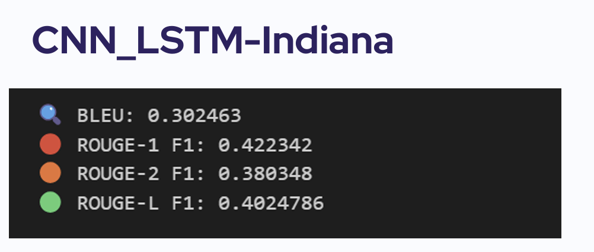
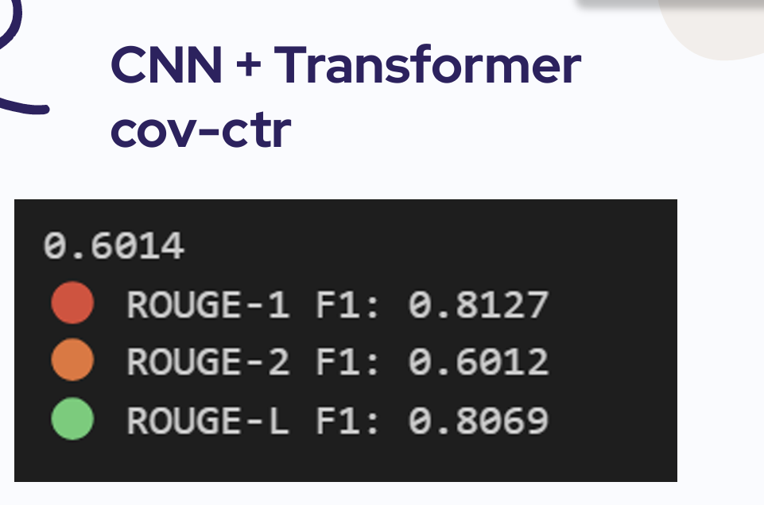

# CXR-ReportNet: Automatic Chest X-ray Report Generation Using Deep Learning

---

## Overview

CXR-ReportNet is a deep learning project for automatically generating radiology reports from chest medical images, including Chest X-rays and CT scans.

The system takes a medical image as input and generates a full-text radiology report similar to those written by radiologists.

---

## Problem Statement

Radiologists spend significant time manually writing diagnostic reports for chest imaging studies.

Challenges include:

- Large volume of imaging studies per day
- Need for consistent and accurate reporting
- Human fatigue leading to reporting delays/errors
- Difficulty generalizing AI systems across image modalities

---

## Project Objectives

- Train AI models to understand chest medical images
- Learn radiology reporting patterns from real doctor-written reports
- Generate coherent full-text medical reports automatically
- Evaluate generalization from Chest X-rays to CT scans
- Compare multiple deep learning architectures

---

## Datasets Used

### Indiana Chest X-ray Dataset

- 7470 Chest X-ray images
- 3852 matching reports
- Frontal and lateral views

### COV-CTR CT Dataset

- 749 Chest CT scans
- 727 matching reports

---

## Data Preprocessing

### Text Processing

- Filled missing findings/impressions
- Removed unmatched samples
- Lowercased text
- Removed punctuation/numbers
- Expanded contractions
- Tokenized and encoded reports

### Image Processing

- Converted grayscale → RGB
- Resized to 224×224
- Normalized pixel values

---

# Model Architectures

---

# Model Architectures

---

## 1. Encoder–Decoder LSTM

### Architecture Overview

DenseNet121 Encoder → LSTM Decoder with Attention

### Pipeline Diagram

### Description

- CNN Encoder extracts visual features from chest X-ray images
- Attention mechanism helps decoder focus on important image regions
- LSTM Decoder generates radiology report token-by-token
- Regularization methods:
  - Dropout
  - Weight Decay
  - Early Stopping
  - Gradient Clipping

---

## 2. CNN + LSTM Enhanced Pipeline

DenseNet121 Encoder → Transformer Encoder → LSTM Refiner → Decoder

### Pipeline Diagram

### Description

- DenseNet121 extracts deep visual features
- Transformer encoder adds contextual understanding
- LSTM refines sequential dependencies
- Decoder generates full report

---

## 3. CNN + Transformer Decoder

ResNet50 Encoder → Transformer Decoder

### Pipeline Diagram

### Description

- ResNet50 extracts 2048-dim features
- Features projected into embedding space
- Transformer Decoder generates report using self-attention
---

## Training Strategy

### Optimization

- Loss Function: CrossEntropyLoss
- Optimizer: AdamW
- LR Scheduler: StepLR

### Regularization

- Dropout
- Weight Decay
- Gradient Clipping
- Early Stopping

### Inference

- Beam Search Decoding

---

# Generated Sample Reports

Below are examples comparing generated reports with ground truth radiologist reports.

---

# Experimental Results

---

## CNN + LSTM on Indiana Dataset

Metrics:

- BLEU: **0.302**
- ROUGE-1: **0.422**
- ROUGE-2: **0.380**
- ROUGE-L: **0.402**

---

## CNN + LSTM on COV-CTR CT Dataset

Metrics:

- BLEU: **0.253**
- ROUGE-1: **0.403**
- ROUGE-2: **0.293**
- ROUGE-L: **0.370**

---

## CNN + Transformer on COV-CTR Dataset

Metrics:

- BLEU: **0.601**
- ROUGE-1: **0.813**
- ROUGE-2: **0.601**
- ROUGE-L: **0.807**

---

# Performance Comparison

| Model | Dataset | BLEU | ROUGE-1 | ROUGE-2 | ROUGE-L |
|--------|--------|------|---------|---------|---------|
| CNN + LSTM | Indiana X-ray | 0.302 | 0.422 | 0.380 | 0.402 |
| CNN + LSTM | COV-CTR CT | 0.253 | 0.403 | 0.293 | 0.370 |
| CNN + Transformer | COV-CTR CT | **0.601** | **0.813** | **0.601** | **0.807** |

---

# Key Findings

## CNN + LSTM

- Performs well on Chest X-ray report generation
- Limited generalization to CT scans

## CNN + Transformer

- Significantly better performance on CT scans
- Better captures complex spatial dependencies
- Self-attention improves understanding of medical image structures

---

# Conclusion

This project demonstrates that:

- Deep learning can generate coherent radiology reports
- CNN+LSTM works well for X-ray datasets
- Transformer decoders generalize better to CT imaging
- Self-attention improves performance on complex medical modalities

---

# Future Work

- Add Vision Transformers (ViT)
- Explore multimodal LLMs (e.g., LLaVA)
- Fine-tune on larger radiology corpora
- Multi-view fusion of frontal/lateral X-rays
- Medical ontology integration (RadLex / CheXpert)

---

# Tech Stack

- Python
- PyTorch
- Torchvision
- NumPy
- Pandas
- NLTK
- Matplotlib

---

# Authors

- Ahmed Gomaa Moftah
- NourElhoda Medhat

Under Supervision of Dr. Mai Mohamed